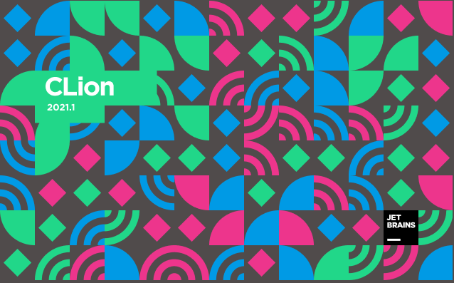

# A toolbox base on cxx20

## license
> If there is no legal license conflict, all files in this repository will be distributed under [see root project license] license.
> If not, corresponding file(source code) (maybe)will waive all rights(keep the rights of [see root project license] as possible as we can).

### requirement:
> gcc version: gcc version 11.0.1 (experimental) (GCC) 

### environment


### install/update gcc11

#### Linux/Unix
```bash
git clone https://github.com/gcc-mirror/gcc.git
cd gcc
./contrib/download_prerequisites
mkdir build && cd build
../configure --disable-multilib
make -j8	# cat /proc/cpuinfo | grep "processor" | wc -l --> if got 8 then set -j8, if got 4 then set -j4
sudo make install

# optional
cd ../..
rm -rf gcc
```

#### possible problem
> /usr/lib64/libstdc++.so.6: version GLIBCXX_3.4.29 not found
```bash
sudo mv /usr/lib/x86_64-linux-gnu/libstdc++.so.6 /usr/lib/x86_64-linux-gnu/libstdc++.so.6.bak

sudo ln -s /usr/local/lib64/libstdc++.so.6 /usr/lib/x86_64-linux-gnu/libstdc++.so.6
# command below
sudo cp /usr/local/lib64/libstdc++.so.6 /usr/lib/x86_64-linux-gnu/libstdc++.so.6 
# also work for me, recommend to use ln, only need to choose one way
```
